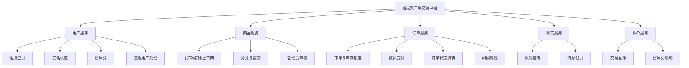
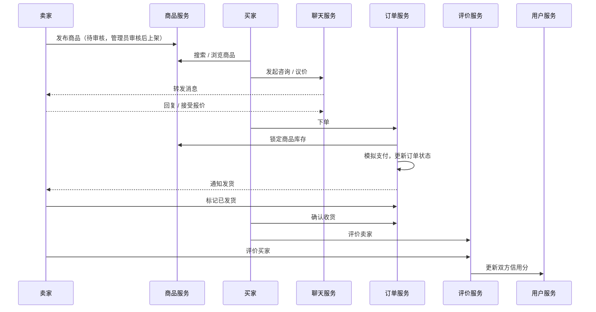
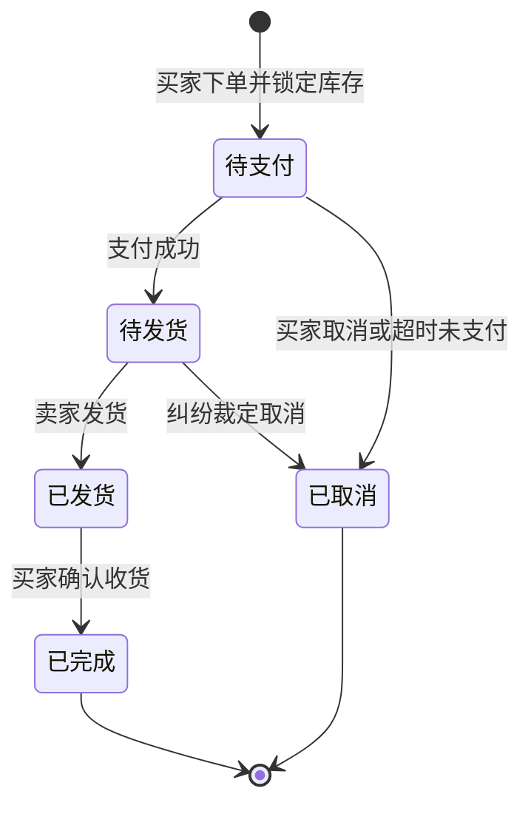

# 拾光集 · 二手交易平台（SecondLight）

> 面向校园及周边社区的二手物品交易微服务系统，是《微服务开发与实践》课程本学期持续演进的唯一项目。

## 项目简介

拾光集是一个二手交易平台，帮助用户便捷、安全地完成闲置物品的发布、浏览、议价、下单与交易评价。系统覆盖"发布商品 → 买卖沟通 → 下单履约 → 互评信用"的完整交易闭环，先以单体形式实现，再随课程进度逐步完成数据库持久化、服务拆分、认证、消息、事务、监控和部署。

## 业务背景

在校园及周边社区中，学生和居民手里常有大量闲置物品（教材、电子产品、生活用品等）需要转手，但现有渠道存在几个实际问题：

- **信息分散**：靠班级群、朋友圈、公告栏零散发布，物品难以被检索，买家找不到、卖家卖不掉。
- **沟通低效**：议价和确认细节依赖私聊，记录容易丢失，双方对成交条件容易产生分歧。
- **缺少信任背书**：陌生人之间交易，无法判断对方是否真实、靠谱，容易出现虚假描述、爽约、纠纷。
- **交易流程不规范**：下单、付款、发货、收货没有统一的状态跟踪，出了问题难以追溯。

拾光集希望通过线上平台，把"发布、沟通、成交、评价"标准化，降低交易双方的沟通成本和信任成本。

## 目标用户及需求

| 角色 | 说明 | 核心需求 |
|---|---|---|
| 买家 | 有闲置物品购买需求的学生和居民 | 快速搜索到合适商品；能与卖家沟通议价；下单流程清晰；能参考卖家信用和历史评价 |
| 卖家 | 有闲置物品出售需求的学生和居民 | 方便发布和管理商品；及时收到咨询和订单通知；订单状态一目了然；积累良好信用 |
| 平台管理员 | 平台运营与审核人员 | 审核商品内容是否合规；处理违规商品和用户；仲裁交易纠纷 |

> 买家和卖家不是两类固定的人：同一个注册用户在购买时是买家，在出售时是卖家。

## 选题说明

### 选择该题目的原因

1. **业务场景真实贴近生活**：闲置物品交易是校园及周边社区的高频需求，问题和用户都清晰具体。
2. **多角色诉求差异明显**：买家、卖家、管理员各有独立的功能诉求，不需要为了凑角色而硬加功能。
3. **技术需求由业务自然产生**：实名与信用需要认证，买卖沟通需要消息，下单锁库存和支付需要事务，各类服务有清晰的边界，后续课程任务都有真实的业务理由。
4. **与课堂示例有区别**：本项目不是校园选课系统的变体，业务规则和数据模型均独立设计。

### 项目的初步边界

- **本学期聚焦**：商品发布与搜索、买卖议价沟通、下单与模拟支付、交易互评与信用分。
- **暂不实现**：真实第三方支付、物流轨迹跟踪、个性化推荐算法。

### 为什么适合在后续课程中逐步演进

| 后续课程任务 | 在本项目中的自然需求 |
|---|---|
| 数据库持久化 | 用户、商品、订单、消息、评价都有明确的实体和关系 |
| 服务拆分 | 用户、商品、订单、聊天、评价五个模块职责清晰、边界明确 |
| 认证 | 交易涉及身份真实性，需要登录鉴权和角色权限区分 |
| 消息 | 买卖议价聊天、下单和发货通知天然适合异步消息 |
| 事务 | "锁定库存、支付、通知发货"跨越多个服务，需要保证一致性 |
| 监控 | 搜索、下单等热点接口需要限流熔断和指标观测 |
| 部署 | 多个服务需要容器化和统一编排 |

## 项目目标与适用场景

### 项目目标

- **业务上**：做一个能完整跑通交易流程的平台。买家能找到商品、和卖家谈价、下单付款；卖家能发布商品、发货、收到评价；管理员能把关商品内容、处理纠纷。信用分的作用是让陌生人之间多一点信任。
- **课程上**：这个项目会贯穿整个学期。先做出功能完整的单体版本，再一步步补上持久化、认证、服务拆分、消息、事务、监控和部署，每一步改造都尽量有真实的业务原因，而不是为了用技术而用技术。

### 适用场景

- 毕业季或换学期时，学生转让教材、电子产品、宿舍用品
- 校园周边社区的居民转让闲置家电、家具、母婴用品
- 同一校区或社区内的同城面交，当面验货

## 用户角色与权限

各角色的需求在前面的表里已经写了，下面这张表是在此基础上，把每个功能具体划给哪个角色。

| 功能 | 买家 | 卖家 | 管理员 |
|---|:---:|:---:|:---:|
| 注册、登录、实名认证 | ✅ | ✅ | ✅ |
| 浏览、搜索商品 | ✅ | ✅ | ✅ |
| 发布、编辑、上下架商品 | — | ✅ | — |
| 审核商品、管理分类 | — | — | ✅ |
| 议价聊天 | ✅ | ✅ | — |
| 下单、模拟支付 | ✅ | — | — |
| 发货 | — | ✅ | — |
| 确认收货 | ✅ | — | — |
| 互评 | ✅ | ✅ | — |
| 处理违规用户、仲裁纠纷 | — | — | ✅ |

## 功能模块划分

整个系统分成五个模块，每个模块只负责自己那一块业务，下面先用一张图看整体结构，再分别说每个模块有哪些功能。

### 用户服务（user-service）

| 功能 | 说明 | 使用角色 |
|---|---|---|
| 注册登录 | 用用户名和密码注册、登录 | 全部 |
| 实名认证 | 提交身份信息，管理员审核通过后拿到认证标识 | 买家、卖家 |
| 个人主页 | 展示昵称、信用分、我发布的商品、我的订单 | 全部 |
| 信用分 | 新用户有一个初始分，随交易评价上下浮动，商品页会显示卖家的信用分 | 买家、卖家 |
| 违规用户处理 | 对违规用户警告或封禁 | 管理员 |

### 商品服务（item-service）

| 功能 | 说明 | 使用角色 |
|---|---|---|
| 发布商品 | 填写标题、描述、价格、分类、成色、图片、数量 | 卖家 |
| 编辑与上下架 | 修改商品信息，主动下架或重新上架 | 卖家 |
| 商品审核 | 新发布的商品要先审核，通过后才会展示给别人 | 管理员 |
| 分类管理 | 维护商品分类，比如教材、数码、生活用品 | 管理员 |
| 搜索与筛选 | 按关键词、分类、价格区间查找，可按时间或价格排序 | 全部 |
| 商品详情 | 展示商品信息、卖家信息和卖家信用分 | 全部 |
| 库存管理 | 提供库存的查询、锁定和释放，给订单服务调用。二手商品大多只有一件，库存默认是 1 | 系统内部 |

### 订单服务（order-service）

| 功能 | 说明 | 使用角色 |
|---|---|---|
| 下单 | 检查商品是否还能买、锁定库存、生成订单 | 买家 |
| 模拟支付 | 用模拟流程代替真实支付，支付后更新订单状态 | 买家 |
| 发货与确认收货 | 卖家标记发货，买家确认收货后订单完成 | 卖家、买家 |
| 取消订单 | 待支付时买家可以取消，超时未支付会自动取消，取消后释放库存 | 买家、系统 |
| 订单查询 | 分别查看"我买到的"和"我卖出的" | 买家、卖家 |
| 纠纷处理 | 处理买卖双方的争议，必要时裁定取消订单 | 管理员 |

### 聊天服务（chat-service）

| 功能 | 说明 | 使用角色 |
|---|---|---|
| 会话创建 | 买家针对某个商品向卖家发起咨询 | 买家 |
| 收发消息 | 双方在会话里互发文字消息 | 买家、卖家 |
| 议价 | 买家提出报价，卖家可以接受或拒绝，接受后按这个价格成交 | 买家、卖家 |
| 历史记录与未读提醒 | 保留聊天记录，标记未读消息 | 买家、卖家 |

### 评价服务（review-service）

| 功能 | 说明 | 使用角色 |
|---|---|---|
| 交易互评 | 订单完成后，买卖双方各评价对方一次（评分加文字） | 买家、卖家 |
| 评价查询 | 按用户或商品查看历史评价 | 全部 |
| 信用分联动 | 评价完成后通知用户服务，更新被评价者的信用分 | 系统内部 |

## 核心业务流程

### 流程一：从发布商品到完成评价

这是整个系统最主要的一条流程，把五个模块都串起来了：

1. 卖家在商品服务发布商品，提交后进入待审核状态。
2. 管理员审核通过，商品上架并对外展示。
3. 买家搜索或浏览，查看商品详情和卖家信用分。
4. 买家在聊天服务里发起咨询，和卖家沟通并议价，卖家接受报价。
5. 买家在订单服务下单，订单服务请求商品服务锁定库存，订单进入"待支付"。
6. 买家完成模拟支付，订单进入"待发货"，同时通知卖家。
7. 卖家发货，订单进入"已发货"。
8. 买家确认收货，订单进入"已完成"。
9. 买卖双方互评，评价服务通知用户服务更新信用分。

### 订单状态流转

订单是流程里状态变化最多的部分，单独画一张图理清楚：

### 异常情况

| 情况 | 处理方式 |
|---|---|
| 议价没谈拢 | 卖家拒绝报价，买家可以重新报价或者放弃，这时不会产生订单 |
| 商品已经被别人买走 | 下单时锁定库存失败，提示买家商品已售出 |
| 超时未支付 | 订单自动取消，释放之前锁定的库存 |
| 交易纠纷 | 买卖双方发起申请，管理员介入，必要时裁定取消订单 |
| 商品审核没通过 | 商品不上架，卖家修改后可以重新提交 |

## 项目范围

选题说明里提到过初步边界，这里把它展开。本学期先把主流程做完整，其他的先不碰，避免范围拉得太大做不完。

| 本学期实现 | 暂不实现 |
|---|---|
| 用户注册登录、实名认证、信用分展示 | 真实第三方支付，用模拟支付代替 |
| 商品发布、编辑、上下架、分类与搜索 | 物流轨迹跟踪，只保留"已发货 / 已收货"状态 |
| 管理员审核商品、处理违规 | 个性化推荐，只做基础的分类和关键词搜索 |
| 下单、库存锁定、模拟支付、订单状态流转 | 图片存储服务，图片先只保存链接 |
| 买卖双方议价聊天 | 实时推送（WebSocket），先做成记录消息、刷新查看 |
| 交易完成后的互评和信用分联动 | 优惠券、活动营销等运营功能 |

## 后续演进方向

下面是大致的演进顺序，具体以课程进度为准。

| 方向 | 计划 | 对应的业务需求 |
|---|---|---|
| 数据库持久化 | 各模块用 MySQL 存数据，先设计好表结构 | 用户、商品、订单这些数据需要长期保存 |
| 认证 | 用 JWT 做统一鉴权，在网关层校验，区分买家、卖家、管理员权限 | 交易涉及身份真实性，管理员功能需要权限隔离 |
| 服务拆分 | 用户、商品、订单、聊天、评价拆成独立的微服务 | 五个模块职责清楚，可以各自开发和扩容 |
| 消息 | 引入 RabbitMQ，处理聊天消息投递、下单和发货通知、信用分更新 | 议价聊天和各类通知本来就适合异步处理 |
| 事务 | 用本地消息表或 Seata 处理"锁库存、支付、通知发货"这条链路 | 下单同时涉及订单和商品两个服务，数据要保持一致 |
| 监控 | 用 Sentinel 做限流熔断，Prometheus 加 Grafana 看指标 | 搜索和下单是热点接口，需要保护和观测 |
| 部署 | 先用 Docker Compose 一键部署，之后视情况再考虑 K8s | 多个服务需要统一启动和管理 |

## 技术栈（规划中）

- 后端框架：Spring Boot、Spring Cloud
- 注册中心 / 配置中心：Nacos
- 网关：Spring Cloud Gateway
- 数据库：MySQL（各服务独立数据库）
- 消息队列：RabbitMQ
- 容器化：Docker / Docker Compose

## 课程信息

- 课程：微服务开发与实践
- 姓名：何衍慧
- 学号：2412190203

## 仓库用途

本仓库用于记录微服务课程的全部作业，包括需求分析、单体系统实现、逐步拆分为微服务的过程、测试、部署以及每周的文档整理。仓库结构随课程进度逐步完善，历史提交记录保持完整、可追溯。

## 目录说明

- `docs/homework/`：每周作业文档，按周次划分子目录
- `src/`：项目源代码，随课程进度逐步添加

## 课程作业记录

- [第1周：开发环境与个人仓库](docs/homework/week-01/index.md)
- [第2周：项目选题与功能规划](docs/homework/week-02/index.md)
